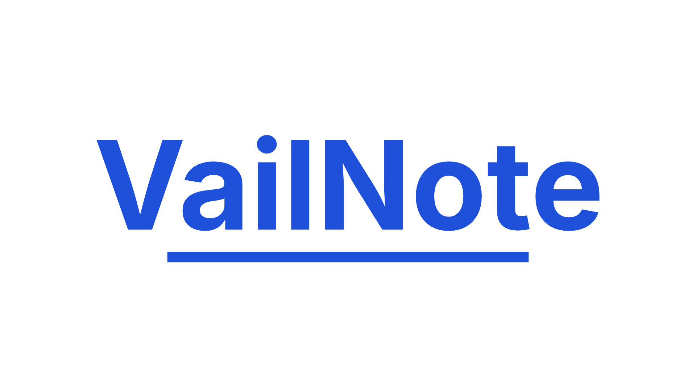

<div id="logo" align="center">
  <a href="https://github.com/emilkrebs/VailNote" target="_blank" rel="noopener noreferrer">
   
 </a>

[](https://fresh.deno.dev)

</div>

# About

VailNote is a simple, **open-source** note-sharing app designed for **maximum privacy**. All notes are encrypted using
modern encryption technology before being stored, ensuring that no one else can access them. The app is built with a
focus on user-friendliness and security.

🔗 See VailNote in action at [vailnote.com](https://vailnote.com).

## Features

- 🔒 **End-to-end encryption**
- 🗂️ **Self-destructing notes** - automatically deleted after viewing
- 🔑 **Optional password protection**
- ⏰ **Configurable expiration times** (10 minutes to 30 days)
- 🚫 **No tracking or analytics**
- 🛡️ **Privacy-preserving rate-limiting** using Anonymous Rate-Limited Credentials (ARC)
  [(View Implementation)](lib/rate-limiting/)
- 🤖 **AI-agent ready** - an official CLI ([`cli/main.ts`](cli/main.ts)) that encrypts/decrypts locally, so agents can
  store and share API keys and other secrets without ever writing them to disk in plaintext. See [llm.txt](llm.txt) for
  the full agent-facing documentation.

## Tech Stack

- **Framework**: [Fresh](https://fresh.deno.dev) (Deno)
- **Runtime**: Deno
- **Database**: FoundationDB (Deno KV)
- **Encryption**: AES-GCM with PBKDF2 key derivation for content encryption, bcrypt for password storage
- **Frontend**: Tailwind CSS & Preact

> [!NOTE]
> Safety and transparency are our top priorities. VailNote is made to be as secure as possible while still being easy to
> use and compatible with most clients. I highly encourage you to look into the architecture to ensure your safety!

# How does VailNote work?

Take a look at the [architecture diagram](#architecture-diagram) for a better visual representation.

Every possible step where I think it might be insecure, given the possibility that the network, server, or database has
The system has been compromised and is marked with (!).

1. Before sending anything to the server, the content will be encrypted.
2. First, the password will be hashed with PBKDF2 for security
3. The original password (not the hash) will then be used to encrypt the content.

- If no password is provided, the client will generate a random phrase (auth key).

4. The client will send the encrypted content, PBKDF2 hashed password, and expiration time to the server.
5. If the document is valid, the server will generate a random note ID, hash the PBKDF2 password again using bcrypt for
   secure storage, and store the note in the database.
6. The server will send a successful response containing the new note ID.
7. The client will generate a valid link using the note ID and local auth key using the following structure:
   `https://vailnote.com/[noteId]#auth=[authKey]`

### Viewing the Note

1. When a note is accessed, the client fetches the encrypted note data from the server.
2. The client asks the user for confirmation before viewing (and destroying) the note.
3. If an auth key is present in the URL, the client uses it to decrypt the note. If a password is required, the client
   prompts for it and decrypts locally.
4. The client never sends the password or auth key to the server—decryption always happens in the browser.
5. After successful decryption, the client requests that the server delete the note.
6. If decryption fails, the note remains on the server until a valid decryption attempt is made or it expires.


## Known Issues

(None)

[Add Issue](https://github.com/emilkrebs/VailNote/issues/new)

## Installation & Development

### Prerequisites

- [Deno](https://deno.land/) v2.3 or later

### Local Development

1. Clone the repository:
   ```bash
   git clone https://github.com/emilkrebs/VailNote.git
   cd VailNote
   ```

2. Set up environment variables:

3. Start the development server:
   ```bash
   deno task start
   ```

4. Open [http://localhost:8000](http://localhost:8000) in your browser

### Environment Variables

- `DATABASE_URI` - Deno KV connection string
- `ARC_SECRET` - Secret for ARC rate-limiting

## AI Agents & CLI

VailNote ships with an official CLI ([`cli/main.ts`](cli/main.ts)) that AI agents (or anyone) can use to create, read,
and delete end-to-end encrypted notes. Content is encrypted locally and decrypted locally - the server only ever stores
ciphertext - so secrets like API keys never touch the disk unencrypted.

### Installing the CLI

**Option 1 - npm (recommended, no Deno needed):** most AI agents already ship with Node/npm, so one command works
everywhere:

```bash
npm install -g vailnote-cli
vailnote --help
```

**Option 2 - Global install with Deno (requires Deno 2.3+):**

```bash
deno install -g -n vailnote --allow-net --allow-env --allow-read https://raw.githubusercontent.com/emilkrebs/VailNote/main/cli/main.ts
vailnote --help
```

Or install from a local clone: `deno task install:cli`.

**Option 3 - Single binary (no Deno needed):** download the prebuilt binary for your platform from the
[GitHub Releases](https://github.com/emilkrebs/VailNote/releases) page (`vailnote-x86_64-unknown-linux-gnu`,
`vailnote-aarch64-apple-darwin`, `vailnote-x86_64-pc-windows-msvc`, ...). They are built automatically whenever a `v*`
tag is pushed. To build one yourself: `deno task build:cli` (produces `./vailnote-cli`).

**Option 4 - Run without installing:** the CLI is dependency-free, so it runs straight from the repo or GitHub:

```bash
deno task cli <command>                                    # from a clone
deno run -A https://raw.githubusercontent.com/emilkrebs/VailNote/main/cli/main.ts <command>
```

### Usage

```bash
# Create an encrypted note. Content via stdin, so it never appears in argv or shell history.
echo "sk-1234..." | vailnote create

# The command prints a link; the #auth= fragment is the decryption key.
# https://vailnote.com/<noteId>#auth=<authKey>

# Read/decrypt a note - the plaintext goes to stdout.
vailnote read "https://vailnote.com/<noteId>#auth=<authKey>"

# Delete a note (required for --manual-deletion notes).
vailnote delete "<link>"
```

Machine-readable output for agent tooling:

```bash
$ echo "sk-1234..." | vailnote create --json
{
  "noteId": "a1b2c3d4e5f6",
  "authKey": "ExAmPlE_AuTh",
  "link": "https://vailnote.com/a1b2c3d4e5f6#auth=ExAmPlE_AuTh",
  "expiresIn": "24h"
}
```

Options:

- `-p, --password <pw>` / `VAILNOTE_PASSWORD` - protect a note with a password. The env var is preferred over argv.
- `-e, --expires-in <opt>` - `10m`, `1h`, `6h`, `12h`, `24h` (default), `3d`, `7d`, `30d`, `90d`, `180d`
- `-m, --manual-deletion` - keep the note until it is explicitly deleted (default: self-destructs after first read)
- `-o, --origin <url>` - API origin for self-hosted instances (env `VAILNOTE_ORIGIN`)
- `-j, --json` - machine-readable output on stdout
- `-h, --help` - full usage

### Storing secrets in your `.env`

Instead of a plaintext API key, your `.env` can hold a VailNote link. The real key never touches disk - each resolution
fetches the ciphertext from the server and decrypts it locally in memory.

```bash
# Create the note once and paste the printed link into your .env.
# Use --manual-deletion, otherwise the note self-destructs on the first read.
echo "sk-1234..." | vailnote create --manual-deletion --expires-in 30d
# OPEN_AI_API_KEY=https://vailnote.com/<noteId>#auth=<authKey>

# Resolve every VailNote link in a .env file to its decrypted value.
vailnote env                 # prints `export KEY='value'` lines
vailnote env ./.env.local --json   # machine-readable

# Load the resolved values into your shell.
set -a; source <(vailnote env); set +a
```

Notes on this pattern:

- Create notes with `--manual-deletion` - auto-delete notes self-destruct on the first read and the `.env` link dies.
- The `#auth=` fragment is the decryption key, so `.env` is still sensitive. Add `--password` to require
  `VAILNOTE_PASSWORD` at resolution time, making the link useless without it.
- Notes referenced from `.env` should use `echo -n` (or `printf`) when created, so no trailing newline is stored.
- Values are single-quoted in the output, so `$` and quotes in secrets survive shell sourcing.

Notes are limited to 46 KB of plaintext (the encrypted value must fit Deno KV's 64 KiB limit). `llm.txt` documents the
HTTP API, encryption protocol, and CLI for AI agents.

## License

This project is licensed under the MIT License - see the [LICENSE.md](LICENSE.md) file for details.
