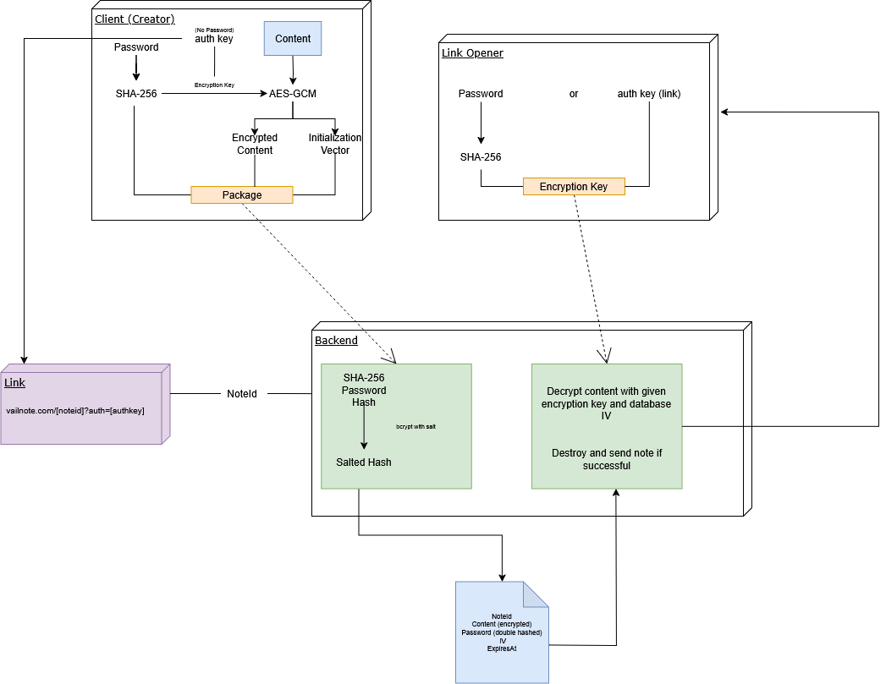

  

  

# About

VailNote is a simple, **open-source** note-sharing app designed for **maximum privacy**. All notes are encrypted using modern encryption technology before being stored, ensuring that no one else can access them. The app is built with a focus on user-friendliness and security.

VailNote is **non-JavaScript compatible**; however, JavaScript is highly recommended for maximizing security and usability.

> [!NOTE]\
> Safety and transparency are our top priorities. VailNote is made to be as secure as possible while still being easy to use and compatible with most clients.
> I highly encourage you to look into the architecture to ensure your safety!

# How does VailNote work?

Since VailNote uses one JavaScript and one non-JavaScript approach, there are two different implementations listed below. Take a look at the [architecture diagram](#architecture-diagram) for a better visual representation.

Every possible step where I think it might be insecure, given the possibility that the network, server, or database has been compromised, has been marked with (!)

### JavaScript (Recommended)
1. Before sending anything to the server, the content will be encrypted.
2. First, the password will be hashed with SHA-256
3. The password hash will then be used to encrypt the content.
  - If no password is provided, the client will generate a random phrase (auth key).
4. The client will send the encrypted content, hashed password, and expiration time to the server.
6. If the document is valid, the server will generate a random note ID, hash the password again using salted hashing (bcrypt), and store the note in the database.
7. The server will send a successful response containing the new note ID.
8. The client will generate a valid link using the note ID and local auth key using the following structure: `https://vailnote.com/[noteId]?auth=[authKey]`

### Non-JavaScript
1. The password and content will be sent to the server as plain text (!)
2. The server will hash the password with SHA-256 and encrypt the content using the password hash. 
  - If no password is provided, the server will use the unique noteID for encryption (!)
3. If the document is valid, the server will generate a random note ID, hash the password again using salted hashing (bcrypt), and store the note in the database.
4. The server will generate a random link using the following structure: `https://vailnote.com/[noteId]`

### Viewing the Note

1. If no password is required, the server will ask for confirmation first.
2. When confirmed, the server will decrypt the note using the auth key (if provided) or note ID
3. If successful, the server will send the decrypted note to the client (!) and destroy the note.

1. If a password is required, the server will prompt a login form.
2. The password will be sent as plain text (!) to the server and hashed using SHA-256
3. The server will compare the password hash to the SHA-256 password.
4. The server will decrypt the content using the SHA-256 password and destroy the note.
3. If successful, the server will send the decrypted note to the client (!) and destroy the note.

## Known Issues

(None)

[Add Issue](https://github.com/emilkrebs/VailNote/issues/new)

# Architecture Diagram

# Screenshots

